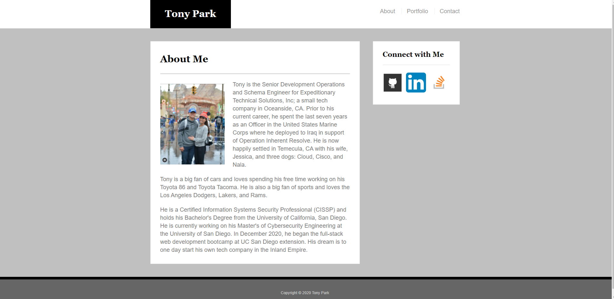
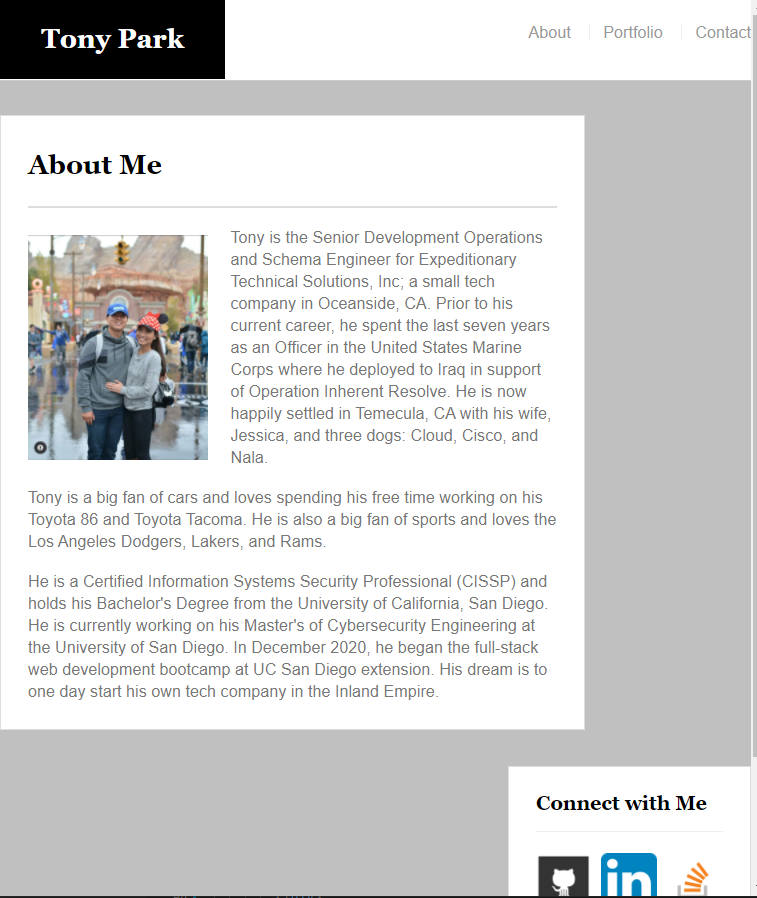
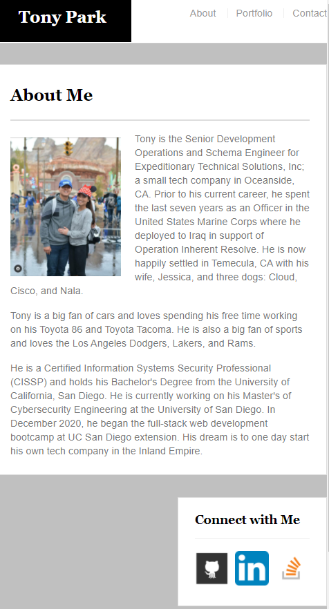

# Bootstrap-Portfolio

- This repository encompasses the homework requirements from Week 2, Week 7, and Week 17

- Heroku Deployment Link: https://boiling-woodland-77101.herokuapp.com/

## Overview

DEC2020: For this project, I've re-created the simple portfolio done for the [Basic Portfolio](https://github.com/tonyrpark/02-bootstrap-css-tonypark) assignment using the Bootstrap CSS framework

APR2021: Added Resume to homepage, fixed links, fixed images, added new portfolio objects

[Updated Page](https://boiling-woodland-77101.herokuapp.com/) to launch Heroku edition

[Old Page](https://tonyrpark.github.io/02-bootstrap-css-tonypark/) to launch the old version

## Built with

- HTML
- CSS
- Bootstrap CSS Framework
- Heroku
- Express

## Bootstrap Components Used

- masthead - `.nav`, `.navbar-header`, `.navbar-brand`
- grid layout - `.container`, `.row`, `.col-[size]-*`
- contact form - `.form-group`, `.form-control`, `.btn`
- portfolio page - `.thumbnail`, `.img-responsive`

## Screenshots

 Large Screenshot 

 Medium Screenshot 

 

 Small Screenshot 

